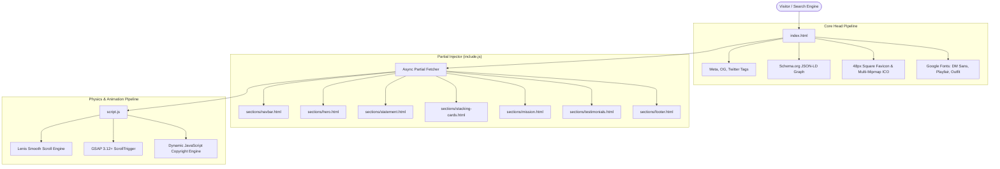

<p align="center">
  <a href="https://www.sunwavespharma.com" target="_blank" rel="noopener noreferrer">
    
  </a>
</p>

<h1 align="center">Sunwaves Pharma</h1>

<p align="center">
  <strong>Precision in Every Injection &bull; WHO-GMP Certified Injectable Pharmaceuticals</strong>
</p>

<p align="center">
  Supplying certified, reliable injectable medicines to hospitals, clinics, healthcare institutions, and distributors across Uganda and East Africa.
</p>

<p align="center">
  <a href="https://www.sunwavespharma.com/"></a>
  <a href="#certifications--standards"></a>
  <a href="#certifications--standards"></a>
  <a href="#seo--search-engine-optimization"></a>
  <a href="#tech-stack"></a>
</p>

<p align="center">
  <a href="https://www.sunwavespharma.com/">Explore Website</a> &bull;
  <a href="#interactive-architecture">Architecture</a> &bull;
  <a href="#section-highlights--capabilities">UI Components</a> &bull;
  <a href="#seo--search-engine-optimization">SEO System</a> &bull;
  <a href="#local-development-setup">Getting Started</a> &bull;
  <a href="#corporate-contact--headquarters">Contact</a>
</p>

---

## Section Highlights & Capabilities

<table width="100%">
  <tr>
    <td width="50%" valign="top">
      <h3>Cinematic Hero Experience</h3>
      <ul>
        <li><b>High-Definition Looping Video</b> background with seamless rotation</li>
        <li><b>Dynamic Action Cards</b>: Fast-track hospital partnership and supply inquiries</li>
        <li><b>Fluid Overlay</b>: High-contrast typography designed for readability on any device</li>
      </ul>
      <p>
        
        
      </p>
    </td>
    <td width="50%" valign="top">
      <h3>Text-Scrub Statement</h3>
      <ul>
        <li><b>Scroll-Linked Progress</b>: Text-fill scrub dynamically highlights statements as user scrolls</li>
        <li><b>Regulatory Accreditation Badges</b>:
          <ul>
            <li><code>WHO-GMP</code>: World Health Organization Good Manufacturing Practices</li>
            <li><code>ISO 9001</code>: Certified Quality Management System</li>
            <li><code>NDA Uganda</code>: National Drug Authority Regulatory Clearance</li>
          </ul>
        </li>
      </ul>
      <p>
        
        
      </p>
    </td>
  </tr>
  <tr>
    <td width="50%" valign="top">
      <h3>3D Stacking Cards</h3>
      <ul>
        <li><b>Card 1</b>: Certified Quality in Every Single Vial</li>
        <li><b>Card 2</b>: Reliable Nationwide Cold-Chain Logistics</li>
        <li><b>Card 3</b>: Comprehensive Hospital Injectables Catalogue</li>
        <li><b>Card 4</b>: Dedicated Institutional Healthcare Partnerships</li>
      </ul>
      <p>
        
        
      </p>
    </td>
    <td width="50%" valign="top">
      <h3>Dual-Mode Testimonials</h3>
      <ul>
        <li><b>Desktop Experience</b>: Pinned horizontal rail slider powered by GSAP <code>ScrollTrigger</code></li>
        <li><b>Mobile Experience</b>: Natural touch gesture swipe slider with inertia tracking</li>
        <li><b>Verified Endorsements</b>: Healthcare providers from Mulago Hospital, Kampala Medical Centre, and Gulu Regional Hospital</li>
      </ul>
      <p>
        
        
      </p>
    </td>
  </tr>
</table>

---

## Interactive Architecture

The site utilizes a lightweight, ultra-fast modular partial architecture. HTML sections are asynchronously fetched in parallel via `include.js` and hydrated with animation listeners once the DOM is assembled.



---

## Tech Stack & Ecosystem

<p align="center">
  
  
  
  
  
  
</p>

| Layer | Technology | Details |
| :--- | :--- | :--- |
| **Structure** | Semantic HTML5 & Partials | Separated component partials inside `sections/` for maintainability |
| **Styling** | Vanilla CSS3 | Custom CSS properties, clamp-based fluid typography, zero CSS framework bloat |
| **Physics** | Lenis 1.1+ | Hardware-accelerated smooth scrolling with natural momentum easing |
| **Interactions** | GreenSock (GSAP 3) | `ScrollTrigger` pinning, timeline scrubbing, and media query adaptation |
| **Media** | WebP & Compressed MP4 | Modern WebP raster assets paired with lightweight looping video buffers |
| **Typography** | Google Fonts API | *DM Sans* (Body/UI), *Playfair Display* (Editorial), *Outfit* (Accents) |

---

## SEO & Search Engine Optimization

The application is engineered to achieve top rankings for **"Sunwaves Pharma"**, hospital procurement, and injectable pharmaceutical queries in East Africa.

### 1. Primary Metadata Matrix
- **Exact Brand Match**: Explicitly targets `<title>Sunwaves Pharma</title>` and `<meta name="title" content="Sunwaves Pharma" />`.
- **Targeted Geo SEO**: Region `UG-102` (Kampala, Uganda) with precise GPS coordinates (`0.3547; 32.5769`) and ICBM tags.
- **Canonical Lock**: Strict canonical declaration at `https://www.sunwavespharma.com/`.

### 2. Schema.org (JSON-LD) Multi-Graph
```json
{
  "@context": "https://schema.org",
  "@graph": [
    {
      "@type": ["Organization", "MedicalBusiness", "WholesaleStore"],
      "name": "Sunwaves Pharma",
      "legalName": "Sunwaves Enterprise (U) Ltd.",
      "url": "https://www.sunwavespharma.com/",
      "address": {
        "streetAddress": "W/H-No. 53, Tirupati Business Park, Kyebando",
        "addressLocality": "Kampala",
        "addressCountry": "UG"
      },
      "hasCredential": ["WHO-GMP", "ISO 9001", "NDA Uganda"]
    }
  ]
}
```

### 3. Google Favicon Specifications
To ensure the custom brand icon displays in Google search results instead of a generic globe:
- **`favicon-48x48.png`**: Exactly 48×48px square PNG required by Googlebot.
- **`favicon-96x96.png`**: High-DPI search result icon.
- **`favicon-192x192.png` & `favicon-512x512.png`**: Progressive Web App standard square icons.
- **`apple-touch-icon.png`**: 180×180px for Apple Safari / iOS.
- **`favicon.ico`**: Valid binary multi-mipmap file containing 16×16, 32×32, and 48×48 layers.

---

## Project Organization

```text
website/
├── assets/
│   ├── images/                  # WebP product mockups and SVG/PNG logos
│   └── videos/                  # Hero & mission looping visual backgrounds
├── css/                         # Section-based modular style sheets
│   ├── base.css                 # Master typography, CSS tokens & resets
│   ├── navbar.css               # Navigation bar & mobile hamburger drawer
│   ├── hero.css                 # Video hero & overlay action cards
│   ├── statement.css            # Highlighted scroll-fill statement
│   ├── stacking-cards.css       # Interactive stacking capabilities cards
│   ├── mission.css              # Mission statement & ambient floating orbs
│   ├── testimonials.css         # Horizontal desktop rail & mobile swipe slider
│   └── footer.css               # Corporate information, contacts & copyright
├── sections/                    # HTML component partials
│   ├── navbar.html
│   ├── hero.html
│   ├── statement.html
│   ├── stacking-cards.html
│   ├── mission.html
│   ├── testimonials.html
│   └── footer.html
├── apple-touch-icon.png         # 180x180 iOS home icon
├── favicon.ico                  # Multi-layer binary icon (16x16, 32x32, 48x48)
├── favicon-48x48.png            # Google SERP requirement (48x48 square)
├── favicon-96x96.png            # High-DPI favicon (96x96)
├── favicon-192x192.png          # Android home screen icon
├── favicon-512x512.png          # PWA high-res icon
├── include.js                   # Asynchronous partial injection engine
├── script.js                    # Lenis smooth scroll, mobile menu, dynamic year
├── styles.css                   # CSS master imports (backward compatibility)
├── index.html                   # Main entry point with full SEO & JSON-LD
├── robots.txt                   # Search engine crawler instructions
└── sitemap.xml                  # Complete XML sitemap
```

---

## Local Development Setup

Because partial templates in `sections/` are retrieved via `fetch()`, run the project through a local HTTP server:

<details>
<summary><b>Option A: VS Code Live Server (Easiest)</b></summary>
<br>

1. Install the **Live Server** extension in Visual Studio Code (`ritwickdey.liveserver`).
2. Right-click on `index.html` and click **Open with Live Server**.
3. Your default browser will launch `http://127.0.0.1:5500`.

</details>

<details>
<summary><b>Option B: Node.js (npx serve)</b></summary>
<br>

```bash
# Launch zero-configuration static file server
npx serve .
```
Navigate to `http://localhost:3000`.

</details>

<details>
<summary><b>Option C: Python 3 Standard Server</b></summary>
<br>

```bash
# Start built-in HTTP server
python -m http.server 8000
```
Navigate to `http://localhost:8000`.

</details>

---

## Corporate Contact & Headquarters

<div align="center">
  <h3>Sunwaves Enterprise (U) Ltd.</h3>
  <p>
    <b>Headquarters</b>: W/H-No. 53, Tirupati Business Park, Kyebando, Kampala, Uganda<br>
    <b>Postal Address</b>: P.O. Box 759125, Kampala, Uganda<br>
    <b>TIN Number</b>: <code>1054264242</code><br>
    <b>Direct Line</b>: <a href="tel:+256758004004">+256 758 004 004</a><br>
    <b>Executive Email</b>: <a href="mailto:vihaan@sunwavespharma.com">vihaan@sunwavespharma.com</a><br>
    <b>Official Website</b>: <a href="https://www.sunwavespharma.com">https://www.sunwavespharma.com</a>
  </p>
</div>

---

<p align="center">
  <sub>&copy; <span id="year">2026</span> <b>Sunwaves Enterprise (U) Ltd.</b> All rights reserved. &bull; Precision in Every Injection</sub>
</p>
